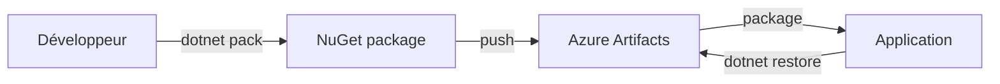

# 📘 Cours Complet sur Azure DevOps

## Sommaire

1. [Fondamentaux : du cycle de vie logiciel au DevOps](#1-fondamentaux--du-cycle-de-vie-logiciel-au-devops)
2. [Azure Boards : gestion de projet agile](#2-azure-boards--gestion-de-projet-agile)
3. [Azure Repos : gestion du code source](#3-azure-repos--gestion-du-code-source)
4. [Azure Pipelines : intégration et livraison continues](#4-azure-pipelines--intégration-et-livraison-continues)
5. [Azure Artifacts : gestion des dépendances](#5-azure-artifacts--gestion-des-dépendances)
6. [Azure Test Plans : validation et qualité](#6-azure-test-plans--validation-et-qualité)
7. [Sécurité avec GitHub Advanced Security](#7-sécurité-avec-github-advanced-security)
8. [Bonnes pratiques et tendances 2026](#8-bonnes-pratiques-et-tendances-2026)

---

## 1. Fondamentaux : du cycle de vie logiciel au DevOps

### 1.1. Le cycle de vie du développement logiciel (SDLC)

Le Software Development Life Cycle (SDLC) est le processus structuré qui guide une équipe de la conception à la maintenance d'un logiciel. Il comporte six phases principales :

| Phase | Objectif | Livrable typique |
|-------|----------|------------------|
| **Planification** | Recueillir les besoins métier | Cahier des charges |
| **Conception** | Définir l'architecture technique | Schémas d'architecture |
| **Développement** | Écrire le code | Code source |
| **Tests** | Valider la qualité | Rapports de tests |
| **Déploiement** | Mettre en production | Application livrée |
| **Maintenance** | Corriger et faire évoluer | Correctifs, nouvelles versions |

### 1.2. Limites des méthodes traditionnelles

Avant DevOps, les équipes de développement (Dev) et d'exploitation (Ops) travaillaient en silos :
- **Livraisons rares** (tous les mois ou trimestres)
- **Intégration difficile** (le code s'accumule avant d'être testé)
- **Déploiements risqués** (grands changements livrés en une fois)

### 1.3. La philosophie DevOps

Le DevOps est un ensemble de pratiques qui fusionne le développement et l'exploitation pour :
- **Livrer plus rapidement** (plusieurs fois par jour possible)
- **Réduire les risques** (petits changements fréquents)
- **Automatiser** (tests, builds, déploiements)

Le principe du **Shift-Left** ("décaler à gauche") consiste à réaliser les activités de test et de sécurité dès le début du cycle, et non à la fin.

### 1.4. Azure DevOps : la plateforme unifiée

Azure DevOps est la suite de services de Microsoft qui couvre l'ensemble du SDLC. Elle remplace l'ancien Visual Studio Team Services (VSTS) et Team Foundation Server (TFS).

**Les cinq services principaux :**

| Service | Usage | Remplace / couvre |
|---------|-------|-------------------|
| Azure Boards | Gestion de projet | TFS Work Item Tracking |
| Azure Repos | Code source | TFS Version Control, GitHub |
| Azure Pipelines | CI/CD | Jenkins, TFS Build/Release |
| Azure Test Plans | Tests | Microsoft Test Manager |
| Azure Artifacts | Paquets | NuGet Server, npm registry |

> **À savoir** : Microsoft rapproche progressivement Azure DevOps et GitHub. Certaines fonctionnalités de sécurité proviennent désormais de GitHub Advanced Security.

---

## 2. Azure Boards : gestion de projet agile

Azure Boards permet de planifier, suivre et discuter du travail.

### 2.1. Les Work Items (éléments de travail)

Ce sont les unités de base du suivi. Voici les types principaux, du plus large au plus détaillé :

```
Epic (très grande initiative)
  └── Feature (fonctionnalité livrable)
        └── User Story (besoin utilisateur)
              └── Task (tâche technique)
              └── Bug (anomalie)
```

**Définition rapide :**
- **User Story** : *« En tant qu'utilisateur, je veux me connecter par email pour accéder à mon compte »*
- **Task** : *« Créer la table Users en base de données »*
- **Bug** : *« La connexion échoue si l'email contient un point »*

### 2.2. Méthodologies supportées

Azure Boards s'adapte à plusieurs cadres agiles. Vous choisissez le vôtre à la création du projet.

| Méthode | Principe clé | Éléments spécifiques |
|---------|--------------|----------------------|
| **Agile** | Itérations courtes (sprints) | Sprints, capacité, burndown |
| **Scrum** | Rôles et cérémonies stricts | Sprint Planning, Retrospective, Daily Scrum |
| **Kanban** | Flux tiré, pas de sprints fixes | Colonnes WIP (travail en cours limité), lead time |

### 2.3. Fonctionnalités clés

- **Tableaux Kanban** : visualisation du flux (À faire → En cours → Fait)
- **Backlogs** : priorisation des stories et features
- **Requêtes** : recherche et filtrage des work items
- **Tableaux de bord** : graphiques d'avancement, vélocité, burndown

### 2.4. Nouveautés 2026 (disponibles ou en préversion)

- **Filtres avancés** : possibilité de filtrer les backlog et les boards sur des champs personnalisés
- **Intégration GitHub Copilot** (généralement disponible) : l'assistant IA aide à rédiger les descriptions des user stories
- **Affichage compact** : les cartes du tableau Kanban peuvent être réduites pour afficher plus d'éléments à l'écran

---

## 3. Azure Repos : gestion du code source

Azure Repos stocke le code et gère les versions.

### 3.1. Deux types de dépôts

| Type | Modèle | Statut (2026) |
|------|--------|----------------|
| **Git** | Décentralisé | ✅ Recommandé, standard |
| **TFVC** (Team Foundation Version Control) | Centralisé | ⚠️ Maintenance uniquement, à éviter pour les nouveaux projets |

**Git en bref** : chaque développeur possède une copie complète de l'historique. Les modifications s'échangent par push et pull.

### 3.2. Commandes Git essentielles dans Azure Repos

| Commande | Effet |
|----------|-------|
| `git clone` | Télécharge le dépôt localement |
| `git branch feature/login` | Crée une branche pour une fonctionnalité |
| `git checkout feature/login` | Bascule sur cette branche |
| `git add .` | Prépare les fichiers modifiés |
| `git commit -m "message"` | Enregistre les modifications localement |
| `git push origin feature/login` | Envoie la branche vers Azure Repos |

### 3.3. Travail collaboratif : la Pull Request (PR)

Une **Pull Request** est une demande de fusion d'une branche (par exemple `feature/login`) vers une autre (souvent `main` ou `develop`).

**Processus typique :**
1. Le développeur pousse sa branche et ouvre une PR
2. Un ou plusieurs collègues **relisent** le code
3. La pipeline CI s'exécute automatiquement (tests, build)
4. Si tout est validé, la PR est **fusionnée** (merged)

**Politiques de branche** (recommandées) : règles obligatoires avant fusion
- Exiger au moins un approbateur
- Exiger que la build CI réussisse
- Interdire la fusion directe vers `main`

### 3.4. Stratégies de branchement courantes

| Stratégie | Principe | Adaptée pour |
|-----------|----------|---------------|
| **Trunk-based** | Très peu de branches, on fusionne souvent dans `main` | Équipes matures, déploiements fréquents |
| **GitFlow** | Branches dédiées (develop, feature, release, hotfix) | Projets avec versions planifiées |

### 3.5. Nouveautés 2026

- **Auto-complétion des PR** : une PR se ferme automatiquement quand toutes les conditions sont remplies
- **Templates pour PR** : des modèles de description spécifiques à chaque type de branche
- **Recherche intégrée** (prévue Q2 2026) : recherche de code sans extension supplémentaire

---

## 4. Azure Pipelines : intégration et livraison continues

C'est le cœur technique du DevOps. Azure Pipelines automatise la construction, les tests et les déploiements.

### 4.1. Concepts CI et CD

| Sigle | Nom | Définition |
|-------|-----|-------------|
| **CI** | Continuous Integration | À chaque modification du code, on compile et on exécute les tests automatiquement |
| **CD** | Continuous Delivery / Deployment | Le code validé est automatiquement déployé (soit vers un environnement de test, soit vers la production) |

**En résumé :** CI = "est-ce que ça casse ?" / CD = "est-ce que ça part en production ?"

### 4.2. Pipelines Classiques vs YAML (point important 2026)

Microsoft distingue deux types de pipelines :

| Type | Configuration | Statut officiel |
|------|---------------|-----------------|
| **Classique** | Interface graphique (point-and-click) | ⚠️ Maintenance uniquement. Pas de nouvelles fonctionnalités. |
| **YAML** | Fichier texte (`azure-pipelines.yml`) versionné dans Git | ✅ Recommandé standard. Toutes les nouveautés. |

**Exemple minimal d'un pipeline YAML :**

```yaml
trigger:
  - main

pool:
  vmImage: 'ubuntu-latest'

steps:
  - script: echo "Début du build"
    displayName: 'Message de démarrage'

  - task: DotNetCoreCLI@2
    inputs:
      command: 'build'
      projects: '**/*.csproj'
    displayName: 'Compilation .NET'

  - task: DotNetCoreCLI@2
    inputs:
      command: 'test'
      projects: '**/*Tests.csproj'
    displayName: 'Exécution des tests unitaires'
```

### 4.3. Composants d'un pipeline

- **Trigger** : ce qui déclenche le pipeline (ex: un push sur la branche `main`)
- **Pool** : l'agent qui exécute les tâches (Microsoft hébergé ou votre propre agent)
- **Steps / Tasks** : les actions unitaires (compiler, tester, publier un artefact)
- **Stages** : regroupement logique (ex: stage Build, stage DeployToDev, stage DeployToProd)

### 4.4. Architectures de déploiement avancées

Pour les applications critiques, on utilise des stratégies qui limitent les risques :

| Stratégie | Principe | Avantage |
|-----------|----------|----------|
| **Blue/Green** | Deux environnements identiques (Bleu = production actuelle, Vert = nouvelle version). On bascule le trafic d'un coup. | Bascule instantanée, rollback facile |
| **Canary** | On expose la nouvelle version à un petit pourcentage d'utilisateurs (5%, puis 25%, puis 100%). | Limite l'impact d'un éventuel bug |
| **Rolling** | On remplace progressivement les anciennes instances. | Pas d'arrêt de service |

### 4.5. Templates YAML : pourquoi et comment

Un **template** est un fichier YAML réutilisable. Il évite de dupliquer la même logique dans 50 pipelines.

**Exemple de template `build-template.yml` :**
```yaml
parameters:
  - name: projectPath
    type: string

steps:
  - task: DotNetCoreCLI@2
    inputs:
      command: 'build'
      projects: '${{ parameters.projectPath }}'
```

**Utilisation dans un pipeline :**
```yaml
steps:
  - template: build-template.yml
    parameters:
      projectPath: '**/MyApp.csproj'
```

### 4.6. Nouveautés 2026

- **Historique par stage** : visualisation claire de ce qui a été déployé sur chaque environnement
- **Amélioration du débogage** : debugger YAML plus puissant
- **Exécution non séquentielle** (roadmap) : possibilité de déclencher des stages indépendants

---

## 5. Azure Artifacts : gestion des dépendances

Les applications modernes utilisent des bibliothèques externes (ex: Newtonsoft.Json pour .NET, React pour JavaScript). Azure Artifacts est un dépôt privé pour stocker vos propres paquets.

### 5.1. Problème résolu

| Situation | Sans Artifacts | Avec Artifacts |
|-----------|----------------|----------------|
| Une équipe produit une bibliothèque interne | Chaque projet copie le code (duplication, mises à jour difficiles) | La bibliothèque est packagée et référencée comme un paquet NuGet/npm |
| Sécurité | On ne sait pas quelles versions sont utilisées | Traçabilité complète, analyses de vulnérabilités |

### 5.2. Flux de travail typique



### 5.3. Formats supportés

- NuGet (.NET)
- npm (JavaScript / Node.js)
- Maven (Java)
- PyPI (Python)
- Universal Packages (fichiers quelconques)

### 5.4. Sécurité intégrée (nouveauté)

Azure Artifacts s'intègre avec **GitHub Advanced Security** pour analyser les dépendances connues comme vulnérables et bloquer leur utilisation.

---

## 6. Azure Test Plans : validation et qualité

Azure Test Plans permet de gérer les tests, qu'ils soient manuels ou automatisés.

### 6.1. Types de tests supportés

| Type | Exécution | Utilisation typique |
|------|-----------|---------------------|
| **Manuel** | Un testeur suit un script pas à pas | Recette fonctionnelle, UAT |
| **Exploratoire** | Sans script, le testeur explore librement | Découverte rapide de bugs |
| **Automatisé** | Script (Selenium, Playwright) intégré à la pipeline | Régression, tests non régressifs |

### 6.2. Organisation d'un plan de test

- **Test Plan** : conteneur global (ex: "Sprint 25")
- **Test Suite** : regroupement logique (ex: "Module Connexion")
- **Test Case** : un test unitaire avec étapes et résultats attendus

### 6.3. Nouveautés 2026

- **Nouveau hub "Test Run"** : interface refondue pour exécuter et visualiser les tests
- **Support de Playwright** : intégration améliorée du framework de test moderne JavaScript
- **Traçabilité enrichie** : les résultats des tests apparaissent directement dans les User Stories associées

---

## 7. Sécurité avec GitHub Advanced Security

Microsoft a intégré les fonctions de sécurité de GitHub dans Azure DevOps (sous licence supplémentaire). C'est le fondement du **DevSecOps** : la sécurité dès la phase de développement.

### 7.1. Trois piliers

| Fonctionnalité | Détection | Comportement |
|----------------|-----------|---------------|
| **CodeQL (Code Scanning)** | Vulnérabilités dans le code source (injections SQL, XSS, buffer overflows) | Analyse lors de chaque build. Remonte dans les résultats de sécurité. |
| **Secret Scanning** | Secrets commités (clés API, mots de passe, tokens) | Alerte. Peut **bloquer le push** en mode Push Protection. |
| **Dependency Scanning** | Paquets tiers vulnérables (via Artifacts) | Alerte dans les dépendances. |

### 7.2. Intégration dans la Pull Request

Lors de l'ouverture d'une PR :
1. CodeQL s'exécute sur le nouveau code
2. Si une vulnérabilité de **sévérité haute** est détectée, la PR est automatiquement bloquée
3. L'auteur reçoit un commentaire avec l'explication et la correction proposée

### 7.3. Nouveautés 2026

- **CodeQL default setup** (préversion publique) : activation en un clic, plus besoin de configuration manuelle
- **Audit des secrets** : les tentatives de push contenant des secrets sont enregistrées dans les logs d'audit

---

## 8. Bonnes pratiques et tendances 2026

### 8.1. Tableau récapitulatif des recommandations

| Domaine | Recommandation 2026 | Justification |
|---------|---------------------|----------------|
| **Pipelines** | Utiliser **uniquement le YAML**. Migrer les pipelines classiques. | Le classique n'évolue plus. |
| **Agents** | Passer aux **Managed DevOps Pools** (remplacement des VM Scale Sets). | Meilleure scalabilité, moins d'administration. |
| **Sécurité** | Activer **GitHub Advanced Security** (au moins Secret Scanning). | Conformité RGAP, protection contre les fuites. |
| **Code** | Centraliser la logique dans des **templates YAML**. | Réduction de duplication, standards homogènes. |
| **Assistance IA** | Utiliser **GitHub Copilot** dans Boards et Repos. | Gain de temps sur les specs et le code. |
| **Stratégie de branche** | **Trunk-based** pour les équipes matures, GitFlow pour les versions planifiées. | Fluidité vs cadence. |

### 8.2. Erreurs fréquentes à éviter

❌ **Ne pas tester dans le pipeline** → laisser des bugs remonter jusqu'en production  
❌ **Configurer manuellement les agents** → utiliser les pools managés dès que possible  
❌ **Ignorer les alertes de sécurité** → traiter chaque alerte CodeQL comme un bug  
❌ **Mélanger classique et YAML** → choisir YAML pour tous les nouveaux pipelines  

### 8.3. Conclusion

Azure DevOps est une plateforme mature qui couvre l'intégralité du cycle de développement. En 2026, les tendances fortes sont :

- **Abandon progressif des interfaces classiques** au profit du YAML (Pipeline as Code)
- **Intégration native de la sécurité** via GitHub Advanced Security
- **Assistance IA** (Copilot) pour la rédaction du code, des tests et des spécifications
- **Convergence Azure DevOps / GitHub** : Microsoft pousse l'utilisation de GitHub pour le code et Azure DevOps pour les pipelines et le suivi, avec des passerelles de plus en plus fluides

**Pour aller plus loin :**

- Documentation officielle : [learn.microsoft.com/azure/devops](https://learn.microsoft.com/azure/devops)
- Roadmap et nouveautés : [Azure DevOps Release Notes](https://learn.microsoft.com/azure/devops/release-notes/features-timeline)
- Parcours d'apprentissage Microsoft Learn : "Azure DevOps Starter" (gratuit)

---

> *Ce cours a été rédigé en mai 2026. Les fonctionnalités en préversion ou roadmap sont mentionnées à titre indicatif et peuvent évoluer.*